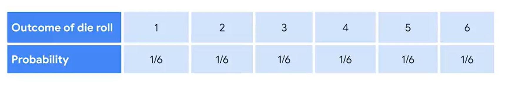
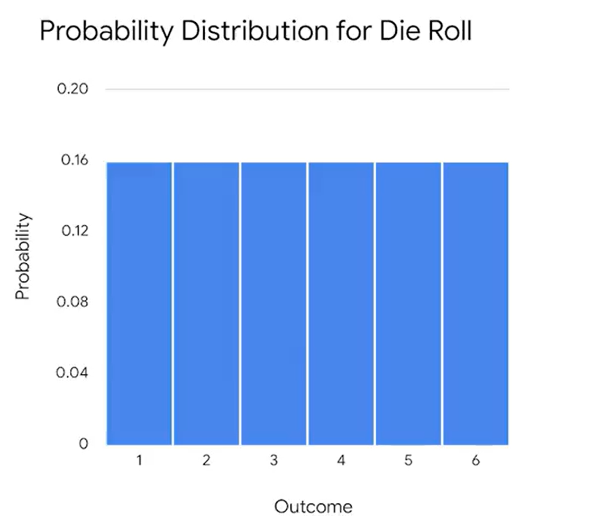

# Discrete probability distribution

## Probability distribution:
Describes the likelyhood of the possible outcomes of a random event

### Random variable:
Represents the values for the possible outcomes of a random event
- Discrete: Countable number of possible values
- Continuous: Takes all the possible values in a range of numbers

- Discrete distribution represent discrete random variables
- Continuous distribution represent continuous random variables

### Sample space:
The set of all possible values for a random variable

### Example:
Single die roll:
- Sample space = {1,2,3,4,5,6}
- Probability of each outcome = 16.7%

  

---
## Binomial distribution
A discrete distribution that models the probability of events with only two possible outcomes, success or failure

This definition assures:
- Each event is independent
- The probability of success is the same for each event

### Mutually exclusive:
Two outcomes are mutually exclusive if they can't occur at the same time

### Random experiment:
A process whose outcome cannot be predicted with certainty
### Binomial Experiment Formula

The probability of obtaining exactly \( x \) successes in \( n \) trials is given by:

<strong>Binomial Experiment Formula</strong> 
P(X = x) = C(n, x) &times; px &times; (1 - p)n - x

<ul>
<li>n = total number of trials</li>
<li>x = number of desired successes</li>
<li>p = probability of success on a single trial</li>
<li>C(n, x) = n! / [x! &times; (n - x)!]</li>
</ul>

---
## Poisson distribution:
Models the probability that a certain number of events will occur during a specific time period

<strong>Poisson Distribution Formula</strong> 
P(X = k) = &lambda;k &times; e&minus;&lambda; / k!

<ul>
  <li><strong>&lambda;</strong> = the average rate (mean) of occurrences (expected value)</li>
  <li><strong>k</strong> = number of occurrences (successes)</li>
  <li><strong>e</strong> = Euler's number, approximately 2.71828</li>
</ul>

---
## Types of distributions:
### Uniform distribution
The uniform distribution describes events whose outcomes are all equally likely, or have equal probability. 
### Binomial distribution 
The binomial distribution models the probability of events with only two possible outcomes: success or failure. These outcomes are mutually exclusive and cannot occur at the same time.
### Bernoulli distribution
The Bernoulli distribution is similar to the binomial distribution as it also models events that have only two possible outcomes (success or failure). The only difference is that the Bernoulli distribution refers to only a single trial of an experiment, while the binomial refers to repeated trials. A classic example of a Bernoulli trial is a single coin toss. 
### Poisson distribution
The Poisson distribution models the probability that a certain number of events will occur during a specific time period. 
