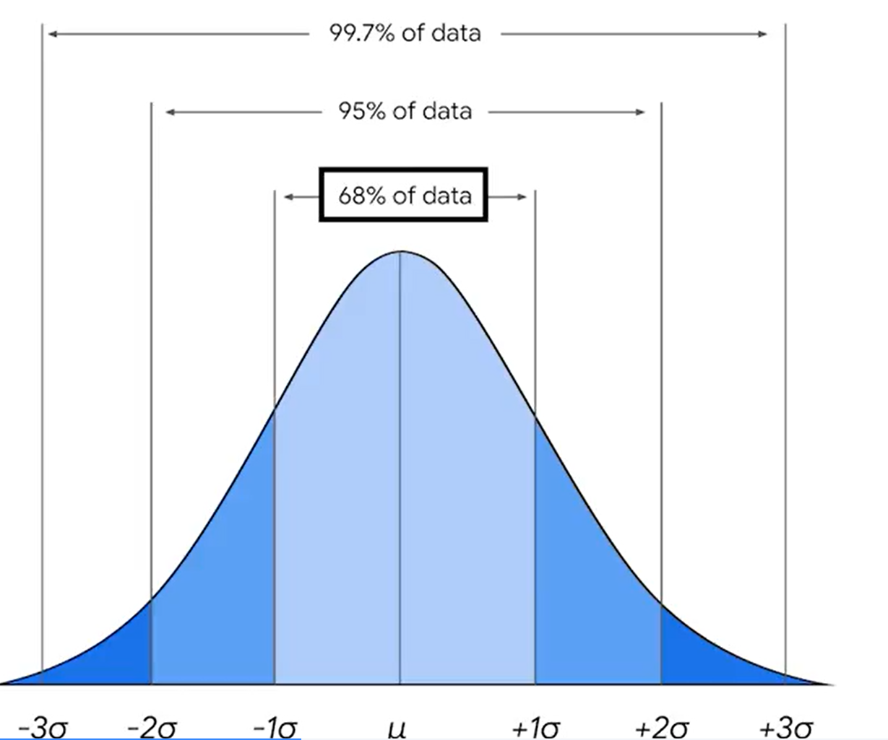

# Continuous probability distributions   

### What is a z-score?

A z-score indicates how many standard deviations a value \( x \) is from the mean (μ).

- **Formula:**  
  z = (x − μ) / σ

- **Interpretation:**
    - z = 0: value equals the mean
    - z > 0: value is above the mean
    - z < 0: value is below the mean  

---
<h3>Normal Distribution</h3>

A normal distribution is a continuous probability distribution that is symmetric around its mean, forming a bell-shaped curve. It is described by its mean (&mu;) and standard deviation (&sigma;).

<strong>Probability Density Function:</strong> 
f(x) = 

&frac{1}{&sigma; &radic;{2&pi;}}
&ensp; &times; &ensp; e &minus; &frac12; (x &minus; &mu;)2 / &sigma;2 

<h3>Empirical Rule (68-95-99.7 Rule)</h3>

The empirical rule states that for a normal distribution:
<ul>
  <li>About <strong>68%</strong> of data falls within 1 standard deviation (&sigma;) of the mean (&mu;).</li>
  <li>About <strong>95%</strong> falls within 2 standard deviations.</li>
  <li>About <strong>99.7%</strong> falls within 3 standard deviations.</li>
</ul>
This rule helps quickly estimate data spread in a bell-shaped distribution.

