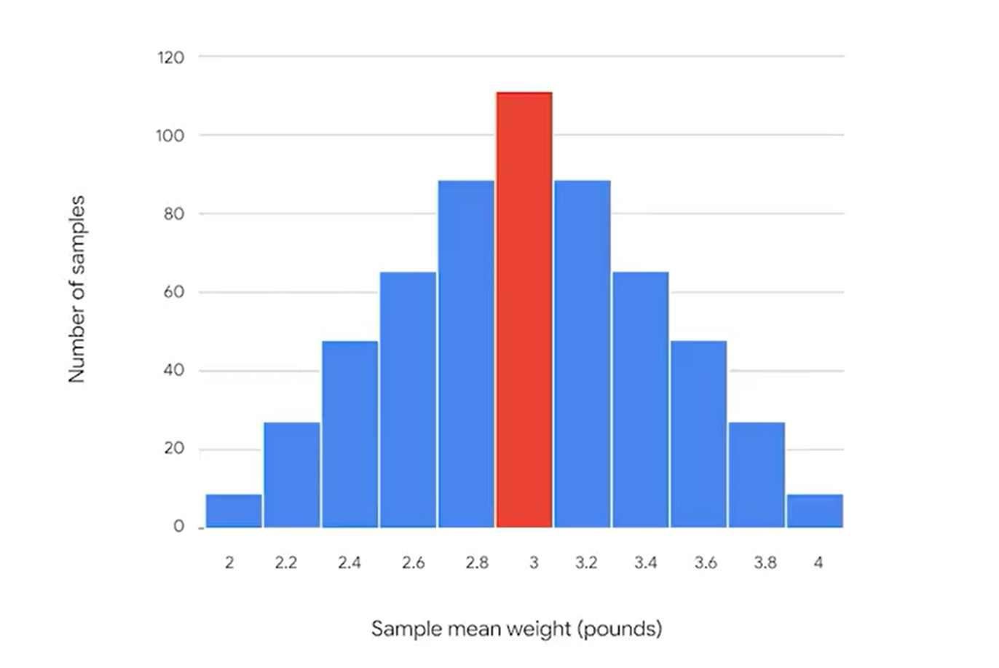

# Sampling
Represents a part of the population

<b> It has to be representative </b>

## The sampling process:
1. Identify the target population
2. Select the sampling frame (filters for data)
3. Choose the sampling method
4. Determine the sample size
5. Collect the sample data

### Sampling methods:
- Probability sampling: Uses random selection to generate a sample
- Non-probability sampling: Based on convenience or personal preference

## Probability sampling methods:
- <b>Simple random sampling</b>: every member of the population is selected randomly with an equal chance of being chosen.
It's representative and can avoid bias.
- <b>Stratified random sampling</b>: divide the population into groups and randomly select some member from each group
.  Members for each group are included
- <b>Cluster random sampling</b>: divide the population into clusters. Randomly select certain clusters, and include all 
members from the chosen clusters in the sample. Helpful when dealing with large and diverse population
with clearly defined subgroups
- <b>Systematic random sampling</b> Put every member of a population into an ordered sequence. Then,
 you choose a random starting point in the sequence and select members for your sample at regular intervals. It's representative 
and quick

## The impact of bias in sampling
<b>Sampling Bias</b>: When a sample is not representative of the population as a whole

### Non-probability sampling methods
- <b>Convenience sampling</b>: Choose members of a population that are easy to contact or reach. Members are often inadequately
represented in the sample.
- <b>Voluntary response sampling</b>: Members of a population who volunteer to participate in a study. Nonresponse bias: when
certain groups of people are less likely to provide responses
- <b>Snowball sampling</b>: Researchers recruit initial people to be in the study and then ask them  to recruit other people to
participate. Sampling bias. People tend to recruit people with similar characteristics.
- <b>Purposive sampling</b>: Researchers select participants based on the purpose of their study.

---
## How sampling affects your data?

### Statistic vs parameter
* The mean weight of a random sample of 100 penguins is a statistic
* The mean weight of the total population of 10000 penguins is a parameter

### Point estimate
A point estimate is a single numerical value used to approximate an unknown population parameter based on sample data.

### Sampling distribution
A sampling distribution is the probability distribution of a given statistic (like the sample mean or proportion) based on all possible samples of a fixed size from a population.

As you increase the sample size the mean weight of the sample data will get closer to the mean weight of the population.
This is based on <b> central limit theorem.</b>

### Standard error
The standard error is the standard deviation of a sampling distribution of a statistic, most commonly the sample mean.
- Larger standard error = Sample means are more spread out
- Smaller standard error = Sample means are closer togheter

<b> Standard error of the mean:</b>
S/sqrt(n)

where:
- s: the sample standard deviation
- n: the sample size

As sample size gets larger the standard error gets smaller.

### The central limit theorem

The sampling distribution of the mean approaches a normal distribution as the sample size increases.

---

### Population proportion
The percentage of individuals or elements in a population that share a certain characteristic.

<b>Standard error of the proportion</b>:

$$
SE = \sqrt{ \frac{p(1 - p)}{n} }
$$

p = sample proportion 

Data professionals use the standard deviation of the sample means to measure this variability. In statistics, the standard deviation of a sample statistic is called the standard error.
