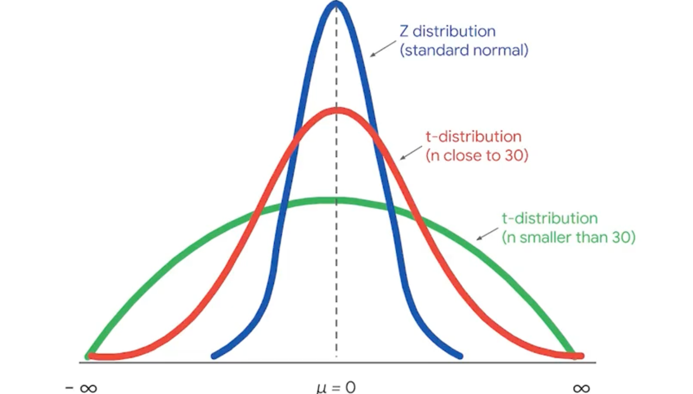

# Twp sample test
## Two sample t-test for means assumptions:
1. The two samples are independent of each other
2. For each sample, the data is drawn randomly from a normally distributed population
3. The population standard deviation is unknown

A <b>two-sample test</b> compares two independent samples to determine if there is a statistically significant difference between their population means.

In this image, we see clearly two distinct groups (represented by two separate bell-shaped curves), each with its own sample mean. The test evaluates whether the difference observed between these two means is significant or likely due to random chance alone.

Typical steps include:

- Formulating the null hypothesis (\(H_0\)): the two populations have equal means.
- Formulating the alternative hypothesis (\(H_a\)): the two populations have different means.
- Computing a test statistic to measure the difference between sample means.
- Evaluating statistical significance by determining a p-value or comparing against a critical value.

If the test indicates significance, it suggests the observed difference between the two samples reflects a genuine difference between their populations.
---
## A/B Testing
A/B testing is a way to compare two versions of something to find out which version performs better. For example, a data professional might use A/B testing to compare two versions of a web page or two versions of an online ad. You also learned that A/B testing utilizes statistical methods such as sampling and hypothesis testing. 
