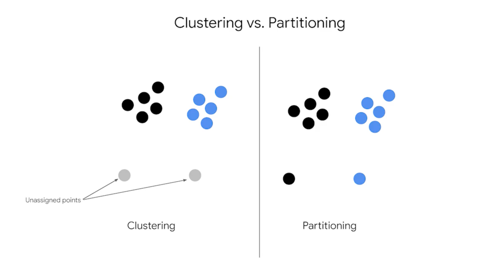

# Introduction to K-means
## K-means:
* Unsupervised learning
* Partitioning algorithm
* Clusters unlabeled data

## Centroid
* The center of a cluster determined by the mathematical mean of all the points in the cluster
* k is the number of clusters

## Clustering vs Partitioning:
!!! K means is a partitioning algorithm

Clustering algorithms may leave certain data points unassigned to any cluster, whereas partitioning methods ensure that every point belongs to exactly one cluster.
---
# DBSCAN
* DBSCAN can identify clusters of arbitrary shapes (elliptical, crescent-shaped, etc.)
* DBSCAN automatically determines the number of clusters based on data density
* DBSCAN can identify and mark points as outliers/noise if they don't belong to any cluster while K-means assigns every point to a cluster, including outliers

### Required parameters 
DBSCAN: epsilon (search radius) and minPoints (minimum number of points to form a cluster)

## DBSCAN VS K MEANS
### Density Sensitivity:
* K-means works well when clusters have similar densities
* DBSCAN excels with clusters of varying densities 

### Use Cases:
* K-means: when you know how many clusters you want and data is relatively spherical
* DBSCAN: when you want to discover natural structures in data and identify outliers

DBSCAN is preferred for data exploration when you don't know the cluster structure, while K-means is better when you want fast segmentation into spherical clusters.

