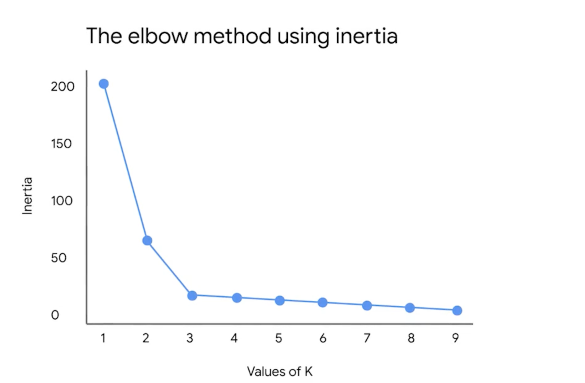
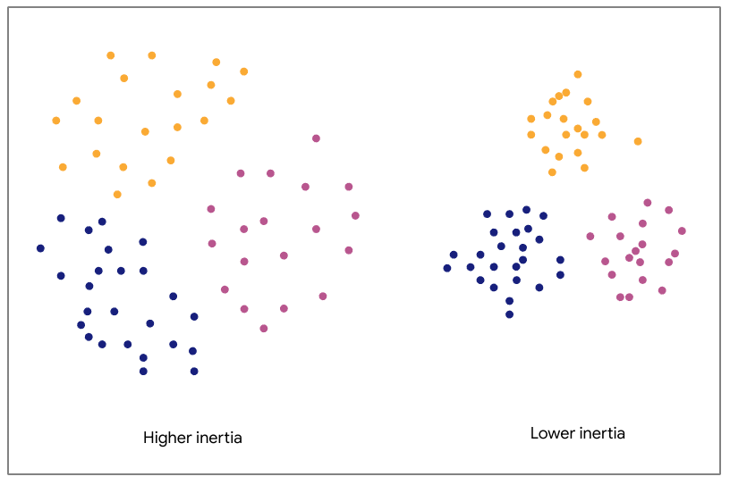
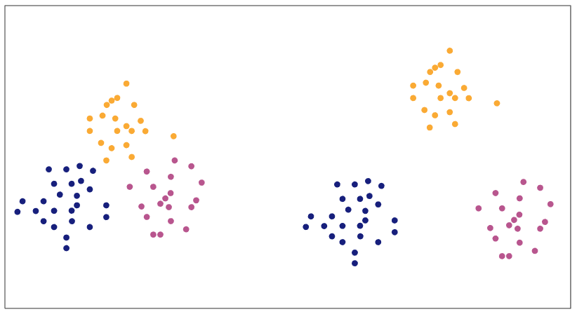

# Key metrics for representing K-means clustering

## Inertia
Sum of the squared distances between each observation and its nearest centroid.

---

# Inertia and silhouette coefficient metrics

## Inertia
It is important to be as close to 0 as possible but not 0 because it will not give any insights for the data.

## Elbow Method
In elbow method we build models for different values of k then we plot the inertia for each k value.

In the elbow method, choose the value of k at the point where the inertia curve starts to bend and the rate of decrease slows down significantly.

## Sillhouette Score
The mean of the silhouette coefficients of all the observations in the model

More precise than inertia because it takes into account the separation between the clusters

-1 <= Sillhouette Score <= 1

The best is 1, it means the clusters are well separated. Somewhere around 0 it means that de observations are at the boundary
between the clusters. If observation is close to -1 they might be in the wrong clusters.

---
# More about inertia and silhouette coefficient metrics

The greater the inertia, the greater the distances between points and their centroids, which means the points within
each cluster are farther apart from each other. In the following figure, the three clusters on the left have higher 
inertia than the three clusters on the right, because they are less compactly positioned around their respective 
centroids. 

## Note, however, that inertia only measures intracluster distance. Therefore, both of the clusterings in the figure below have the same inertia.

