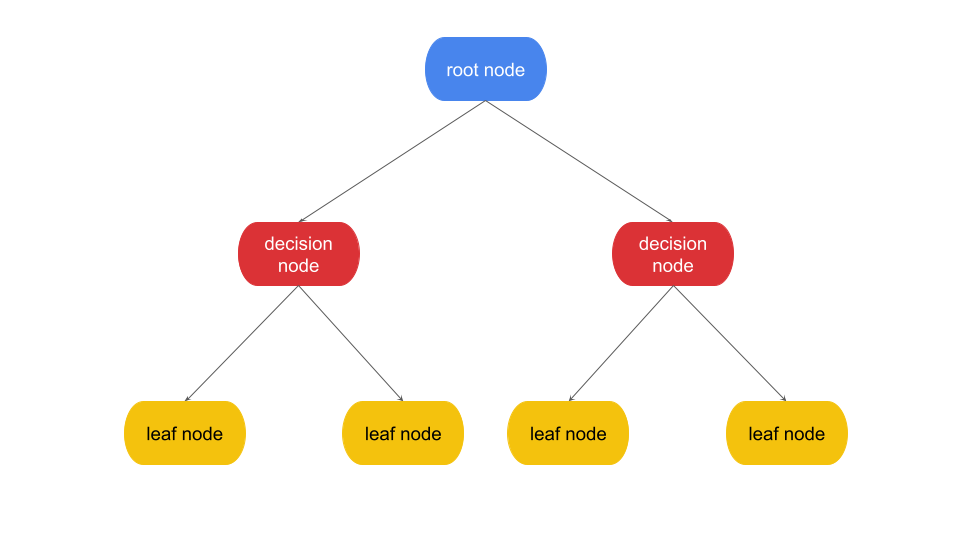
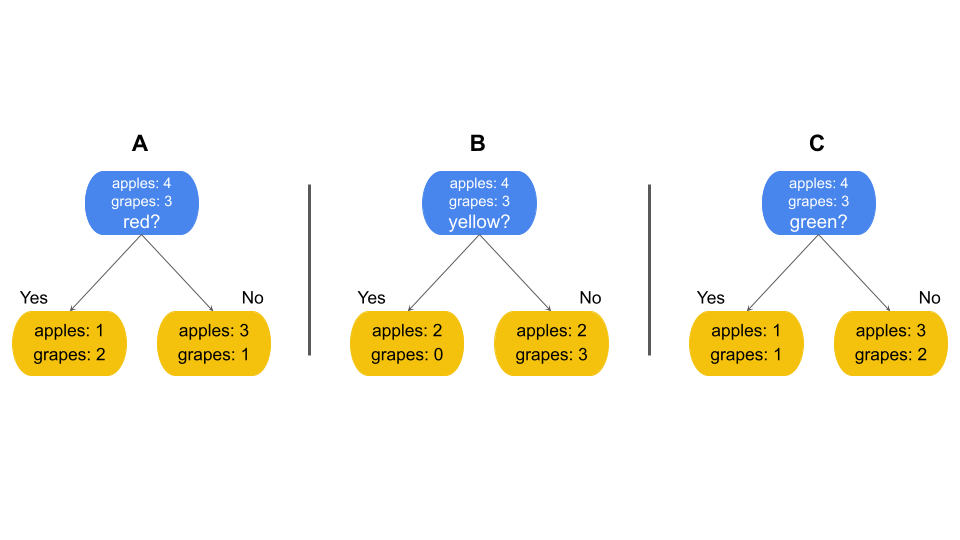
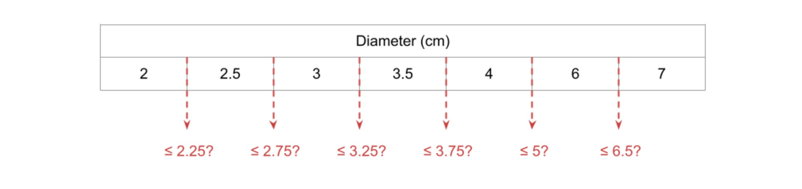
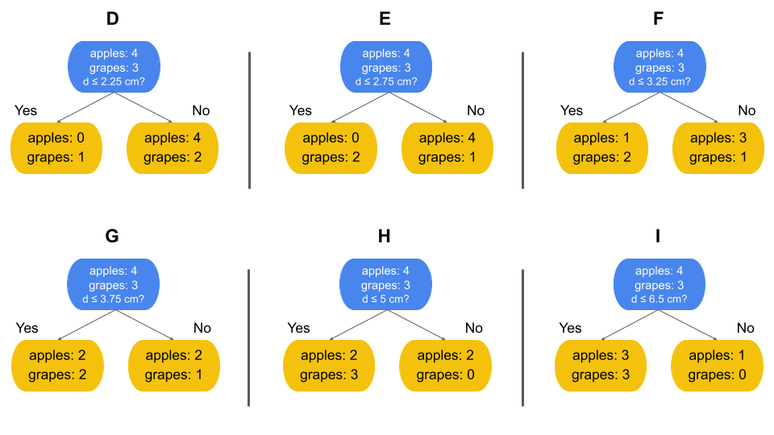

# Tree-based learning
A type of supervised machine learning that performs classification and regression tasks

---
# Tree-based modeling

## Decision trees
* Require no assumptions regarding distribution of data
* Handles collinearity very easily
* Often doesn't require data preprocessing
* It can easley overfit

### Root node:
The first node of the tree, where the first decision is made

### Decision node:
Nodes of the tree where decisions are made

### Leaf node:
The final prediction node

### Example:

| Color  | Diameter (cm) | Fruit (target) |
|--------|----------------|----------------|
| Yellow | 3.5            | Apple          |
| Yellow | 7              | Apple          |
| Red    | 2              | Grape          |
| Red    | 2.5            | Grape          |
| Green  | 4              | Grape          |
| Green  | 3              | Apple          |
| Red    | 6              | Apple          |

First, the algorithm will consider splitting based on the categorical variable, color. Since there are three categories, 
three options are considered. Note that “yes” always goes to the left and “no” to the right.

#### Continuous variables:

If the predictor variable is continuous, splits can be made anywhere along the range of numbers that exist in the data. Often the potential split points are determined by sorting the values for the feature and taking the mean of each consecutive pair of values. However, there can be any number of split points, and fewer split points can be considered to save computational resources and time. It is very common, especially when dealing with very large ranges of numbers, to consider split points along percentiles of the distribution.

In the case of the fruit example, “Diameter” is a continuous variable. One way a decision tree could handle this is to:

1. Sort the values, identify average of consecutive values:

2. Examine splitting based on these identified means:

These are the six potential split points for the Diameter feature that were identified by the algorithm. Each option includes the children of that split, but note that at this point none of them has been evaluated yet. That’s the next step. 

#### Choosing splits: Gini impurity

Now you know how to determine the potential split points. In the fruit example, there are nine options to choose from: A–I. But how do you decide which split to use? This is where the “purity” of the child nodes becomes relevant. Generally, splits are better when each resulting child node contains many more samples of one class than any other, like in example E above, because this means the split is effectively separating the classes—the primary job of the decision tree! In such cases, the child nodes are said to have low impurity (or high purity). The decision tree algorithm determines the split that will result in the lowest impurity among the child nodes by performing a calculation.

There are several possible metrics to use to determine the purity of a node and to decide how to split, including Gini impurity, entropy, information gain, and log loss. The most straightforward is Gini impurity, and it’s also the default for the decision tree classifier in scikit-learn, so this reading will focus on that method. The Gini impurity of a node is defined as:

Gini Impurity: G = 1 − Σ pᵢ²

p(i) =  the probability of samples belonging to class i in a given node.