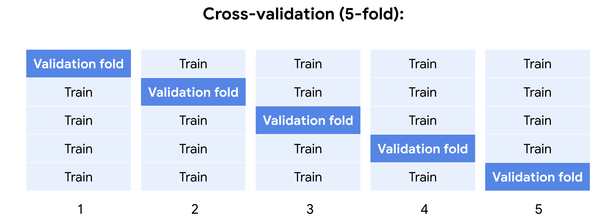

# Tune a decision tree

Tips:
- For a decision tree is not necessary to use one hot encoding, you can use label encoding

## Hyperparameters
Parameters that can be set before the model is trained

### max_depth
Defines how "long" a decision tree can get. (Root node is considered level 0)

Setting a lower value for max depth might help the overfitting problem.

### min_samples_split
min_samples_split is the minimum number of samples that a node must have for it to split into more nodes. For example, if you set this to 10, then any node that contains nine or fewer samples will automatically become a leaf node. It will not continue splitting. However, if the node contains 10+ samples, it may continue to split into child nodes. The greater the value you use for min_samples_split, the sooner the tree will stop growing. The minimum possible value is two, because two is the smallest number that can be divided into two separate child nodes.

### min_samples_leaf
min_samples_leaf is similar to min_samples_split, but with an important difference. Instead of defining how many samples the parent node must have before splitting, min_samples_leaf defines the minimum number of samples that must be in each child node after the parent splits. Consider the following example, where min_samples_leaf is set to three.  

## GridSearch
A tool to confirm that a model achieves its intended purpose by systematically checking every combination of hyperparameters to identify which set produces the best results, based on the selected metric

---
# Verify performance using validation

## Model validation
The set of processes and activities intended to verify that models are performing as expected.

## Cross-validation
A process that uses different portions of the data to test and train a model on different iterations

